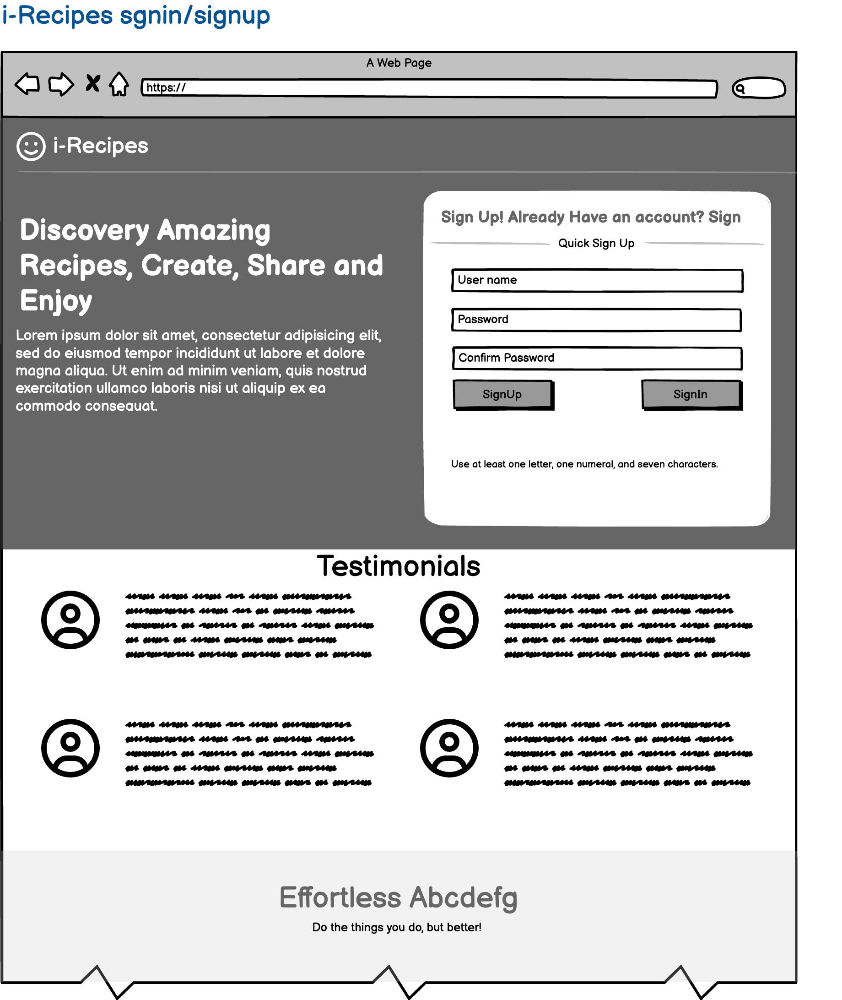
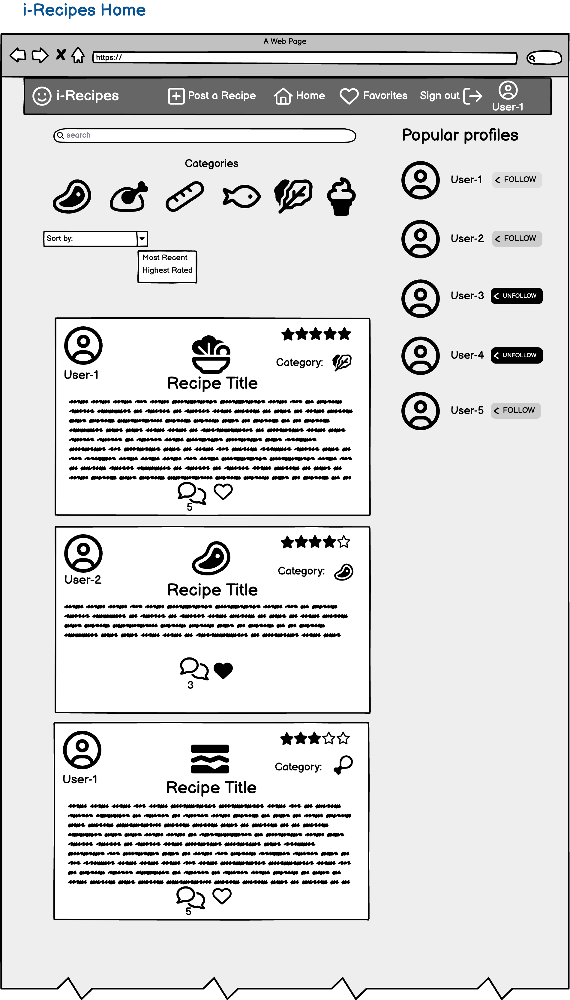
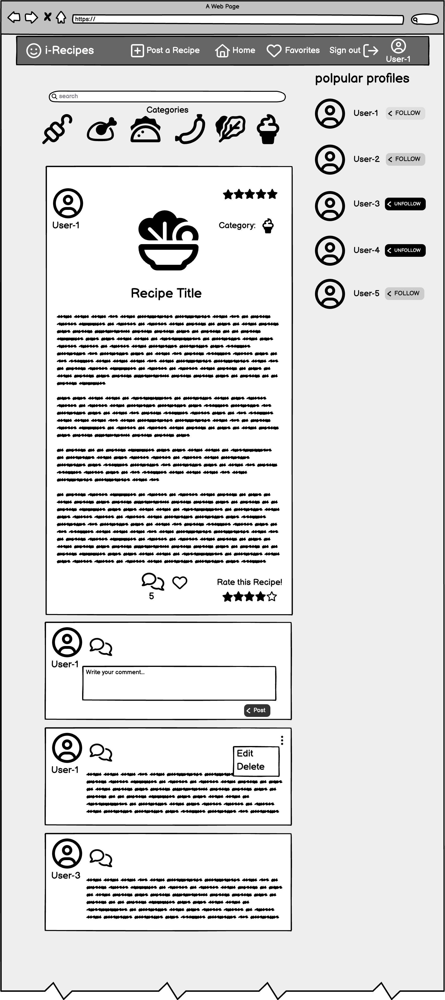
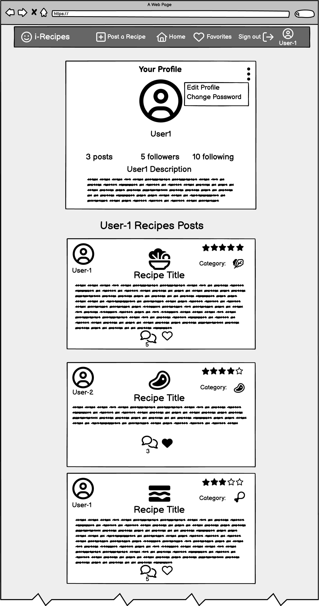
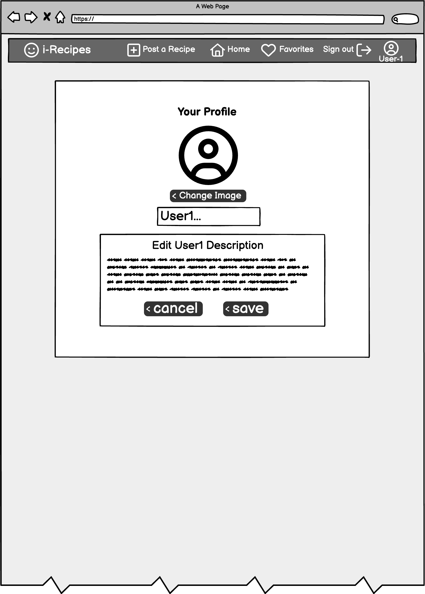
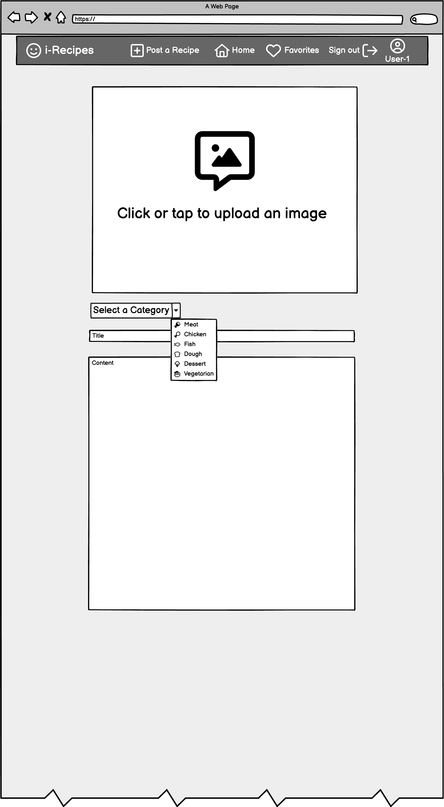
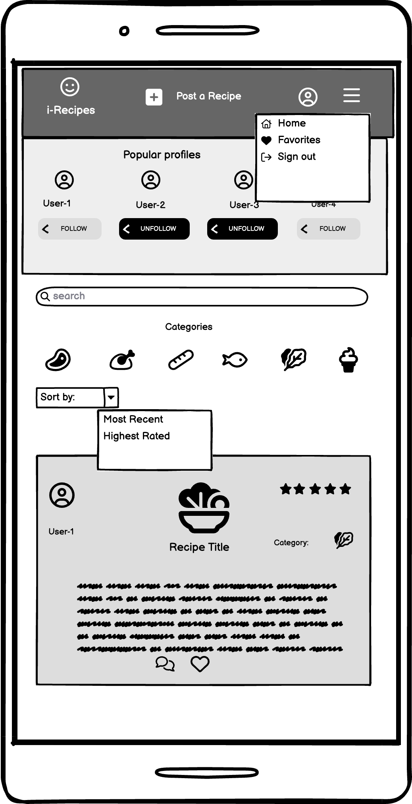

# i-recipes

## Description
- Welcome to i-recipes, a comprehensive and interactive platform designed to cater to culinary enthusiasts and food lovers alike. This platform is a community-driven space where users can explore, share, and engage with a wide range of recipes. Our goal is to create an intuitive, user-friendly environment that enhances the cooking experience and fosters a vibrant community of food aficionados.

- Key Features
Membership Access: Users can sign up to become members of the platform, unlocking the ability to interact and fully utilize all functionalities.

- Intuitive Navigation: The platform is designed for ease of use, allowing users to effortlessly access all pages and features.

- Advanced Search: A robust search function enables users to quickly find specific content, making the discovery of recipes simple and efficient.

- Recipe Categories: Users can browse through various recipe categories, aiding in finding the perfect dish for any occasion.

- Sorting and Filtering: Recipes can be sorted by their popularity or rating, helping users discover the latest trends or the highest recommended dishes.

- Community Interaction: Members can follow other users' profiles, comment on recipes, and engage in community discussions, creating a dynamic and interactive environment.

- Content Sharing: Users have the ability to post their own recipes, complete with images, to share their culinary creations with the community.

- Personalization: Each user can edit their profile and manage their account settings, including password changes, to maintain a secure and personalized experience.

- Feedback Mechanism: The platform encourages community participation through features like recipe rating and liking, helping others in the community to identify the most delightful dishes.

## Our Vision
i-Recipes is more than just a recipe-sharing platform; it's a place where culinary passions are ignited, and connections are made. Whether you're a seasoned chef or a beginner cook, our platform offers something for everyone. Join us on this delicious journey and be part of a community that celebrates the joy of cooking and sharing.

## User Stories

1.  As a **user**, I can **sign up** so that **I can be a platform member**

2.  As a **user**, I can **sign in** so that **I can interact and use all of the platform functionalities**

3. As a **user**, I can **access all the platform pages and functionality in the layout ** so that **I can navigate intuitively**

4. As a **user**, I can **search for content in the search bar** so that **I can find specific content easily**

5. As a **user**, I can **navigate through recipe categories** so that **I can find what I’m looking for easily**

6. As a **user**, I can **have the possibility to sort the recipe posts by most recent or highest rated** so that **I can find the newest recipes or the most recommended recipes**

7. As a **user**, I can **Follow other profiles** so that **I can be in tune with other user’s posts**

8. As a **user**, I can **have a list of the most popular profiles** so that **I can follow and be in tune with the most popular profiles**

9. As a **user**, I can **comment on a recipe ** so that **I can interact and react to other comments**

10. As a **user**, I can **edit or delete a comment** so that **I can do it if I change my mind**

11. As a **user**, I can **rate a recipe** so that **I can participate and help the community find the most delicious recipes**

12. As a **user**, I can **like a recipe** so that **I can find the recipes I liked later on**

13. As a **user**, I can **post a recipe** so that **I can participate and share my favorite recipes with the community**

14. As a **user**, I can **post an image** so that ** I can illustrate my post**

15. As a **user**, I can **edit my Profile** so that **I have an identity in the platform**

16. As a **user**, I can **change my password** so that **my account is safe**

## Wire Frames

### Sign-In/SignUp
- 
### Home
- 
### Recipe Page
- 
### Profile page 
- 
### Edit Profile Page
- 
### Add a Post
- 
### Mobile Home
- 